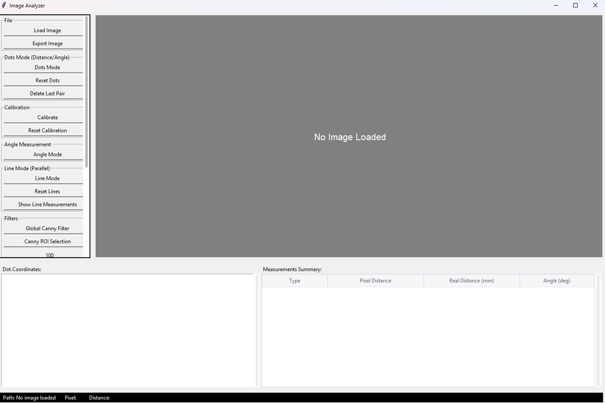

# Tkinter Image Analyzer

A desktop application built with Python and Tkinter for analyzing images, performing measurements, and applying filters like Canny edge detection.

## Features

*   Load various image formats (PNG, JPG, BMP, GIF, TIF).
*   Navigate between images in the same folder.
*   Zoom In/Out using mouse wheel or keys.
*   Magnifying Zoom Box for precise cursor placement.
*   **Measurement Modes:**
    *   **Calibration:** Set a real-world scale using known distances in the image.
    *   **Dots Mode:** Measure pixel distance, real distance (if calibrated), and angle between pairs of points.
    *   **Angle Mode:** Measure the angle formed by three points.
    *   **Line Mode:** Draw two lines and calculate lengths, angle deviation, and perpendicular distances between them at multiple points. Displays detailed results.
*   **Filters:**
    *   **Global Canny Edge Detection:** Apply Canny filter to the entire image with adjustable low/high thresholds.
    *   **ROI Canny Edge Detection:** Apply Canny filter only within a user-selected rectangular region with adjustable thresholds.
*   Undo/Redo functionality for actions.
*   Display coordinates of placed points.
*   Summary table of all measurements.
*   Export the annotated image (with overlays) as a new image file.
*   Save analysis results (metadata, calibration, measurements including pixel and mm values) to a JSON file.
*   Scrollable button panel for accessing all features.

## Screenshots

*Overview of the Image Analyzer's user interface. The left panel provides access to core features like image loading, calibration, various measurement tools (point pairs, angles, parallel lines), Canny edge detection filters (global and ROI-based), zoom controls, undo/redo, and options to export annotated images and save measurement data.*



## Requirements

*   Python 3.7+
*   Libraries listed in `requirements.txt`. You can install them using pip.

## Installation

1.  **Clone the repository:**
    ```bash
    git clone https://github.com/your-username/image-analyzer.git # Replace with your repo URL
    cd image-analyzer
    ```

2.  **Create a virtual environment (Recommended):**
    ```bash
    python -m venv venv
    # Activate the environment
    # Windows:
    .\venv\Scripts\activate
    # macOS/Linux:
    source venv/bin/activate
    ```

3.  **Install dependencies:**
    ```bash
    pip install -r requirements.txt
    ```

## Usage

1.  Make sure your virtual environment is activated (if you created one).
2.  Run the application:
    ```bash
    python app.py
    ```
3.  Use the "Load Image" button to open an image file.
4.  Use the buttons on the left panel to select modes (Calibration, Dots, Angle, Line, Filters) and perform actions.
5.  Use the mouse wheel or +/- keys to zoom.
6.  Use Left/Right arrow keys to navigate images in the same folder.
7.  Enter metadata and click "Save Measurements" to export data to JSON.
8.  Use "Export Image" to save the image with annotations.

## Contributing

Contributions are welcome! Please feel free to submit a Pull Request or open an Issue for bugs, feature requests, or suggestions.

*(Optional: Add more detailed contribution guidelines, e.g., coding style, branch naming)*

## License

This project is licensed under the MIT License - see the [LICENSE](LICENSE) file for details.
